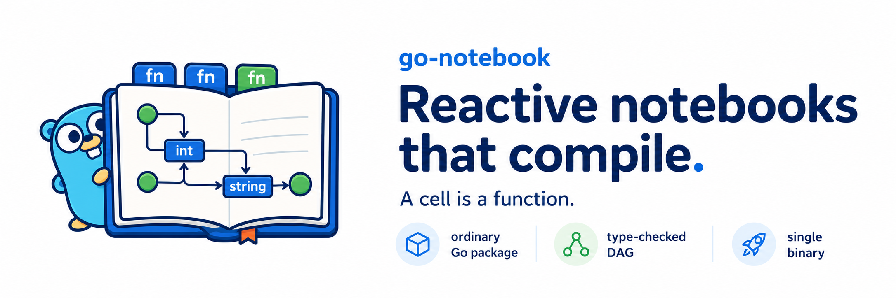

<p align="center">
  
</p>

<p align="center">
  <a href="https://github.com/scttfrdmn/go-notebook/actions/workflows/ci.yml"></a>
  <a href="https://github.com/scttfrdmn/go-notebook/actions/workflows/lint.yml"></a>
  <a href="https://pkg.go.dev/github.com/scttfrdmn/go-notebook"></a>
  
</p>

**A reactive notebook where the notebook *is* an ordinary Go package.**

A cell is a top-level function with a doc comment. The dependency graph is a projection of the type checker's own def-use analysis. The result compiles to a single static binary — so a notebook is also a job:

```
go tool notebook run ./examples/capacity     # interactive
sbatch ./capacity                            # the same file, as a job
```

No `.ipynb`. No kernel. No spawner. No conda environment to reconstitute. **A notebook file contains no mention of this project** — no import, no framework, nothing but `//go:notebook` and Go.

```go
//go:notebook
package capacity

// Incoming jobs per hour.
//notebook:slider min=0 max=5000 step=50
func arrivalRate() (lambda PerHour) { return 1200 }

// Offered load in Erlangs.
func offeredLoad(lambda, mu PerHour) (a Erlangs) {
    return Erlangs(float64(lambda) / float64(mu))
}
```

The wiring rule, in one sentence:

> **A cell's named result feeds any cell that takes a parameter of the same name and type.**

---

## Status

**The core loop is built and the compile-first bet is measured.** The toolchain analyzes a notebook, derives the graph from `go/types`, generates a registry via `go build -overlay` (never touching your source tree), and runs it through a glitch-free reactive engine served to a browser — or headless as a batch job.

```
go tool notebook check ./examples/capacity     # print the dependency graph
go tool notebook run   ./examples/capacity     # serve it; edit source, it rebuilds
go tool notebook build ./examples/capacity     # emit a standalone binary
./capacity --headless --set servers=120 --json # the same file, as a job
```

The four kill criteria, measured on an M4 Pro (see the design's `docs/core-loop-spec.md` §7 for what each proves):

| KC | What | Target | Measured | |
|----|------|--------|----------|--|
| KC1 | cold graph derivation | < 1 s | **86 ms** | ✅ |
| KC2 | re-analysis after a one-cell edit | < 100 ms | **~0.5 ms** | ✅ |
| KC3 | slider → repaint (p95) | < 50 ms | **~15 µs** engine + **~165 µs** transport | ✅ |
| KC4 | save → rebuild → restart → repaint | < 500 ms* | **~470 ms** (capacity) · **~760 ms** (lego) | ✅ |

KC2 — the number the design hinged on — lands with a ~200× margin, which retires the project's largest engineering risk (incremental analysis) and defers the gopls migration indefinitely.

**KC4 is a compiled dev loop, and it behaves like one.** `capacity` (234 lines) rebuilds in ~470 ms; `lego` (575 lines, the largest buildable example) in ~760 ms — measured externally, edit → server serving the new result. It scales with notebook size, as any compile step does. The right comparison is explicit: this is the same band as a Vite rebuild or `cargo check`, and nobody calls those broken. The *contrast* that matters runs the other way — Jupyter/marimo cold-start is 1–3 s before first render and their slider path re-executes Python; ours pays the compile tax on the rarest action (a source save) and returns a slider repaint in ~15 µs on the most frequent one.

\* The 500 ms line was a spec guess with no baseline; the honest target for a compiled loop is "in the dev-tool band," which it is. A save is also a deliberate act — the ~1 s of human latency (⌘S, glance up, reach for the mouse) runs concurrently with the build, so the measured wall-clock is not time the user spends waiting.

Where the time goes: `go build` ~285 ms + OS first-exec of a fresh binary ~180 ms + initial wave; the engine itself contributes ~13 ms (a wave is ~2 µs). The compile cost is not a liability the design tolerates — it is the **premise**: it is what buys the static binary, `sbatch ./notebook`, the type-checker-derived graph, the typed wiring, the zero imports, and the 2 µs wave. Paying it on save is the price of admission for everything else.

Overlapping the rebuild with the running binary ([#22](https://github.com/scttfrdmn/go-notebook/issues/22)) keeps the notebook *responsive during* a rebuild — no dark screen — a responsiveness win, not a latency one (time-to-reflect-an-edit is inherently build + exec). Pre-warming the new binary was tried and removed: it cost a full headless wave, more than the first-exec it saved.

**Two stories, both working.** The differentiated one is batch and cluster: the same file is a notebook, an `sbatch` job, and a callable model (`--headless --set --json`). The familiar one is interactive: edit source, see the chart move — at every notebook size measured. Neither is a consolation for the other.

**Built so far:** `internal/graph` (plain-data IR, no `go/types`), `internal/analyze` (incremental type-checking `Session`, CHA-based purity **and** WASM-portability), `internal/gen` (codegen + overlay), `engine` (head + epoch'd glitch-free scheduler + cache + capability probes + safe markdown rendering), `engine/server` (SSE + edits; the only `net/http`), `engine/wasm` (the browser transport, a `syscall/js` sibling of the server), and `internal/webui` (the shared browser client). Grips, the widget vocabulary (`Multi`/`Select`/`Range`/`Table`/`Draggable`), and all four topologies including WASM are **built** — **34 of ~39 notebooks run live in the browser.** Composition is built too: `//notebook:area=` and a package-level `//notebook:layout` arrange a notebook as a designed dashboard (cards, columns) rather than a source-order stack, fully optional and degrading to linear (see *Composing a notebook* below). Views can defer their design to HTML — an invoice, a table, a heatmap — when the answer is a document rather than a chart. Still deferred: `Prev[T]` folds (dynamics use fixed-horizon pure cells instead). SQL/`Rel[T]` is **withdrawn**, not deferred — typed Go operations over `Rel[T]` deliver the same compile-time guarantee without a parser or cgo (see the design's *SQL claim, withdrawn*). Progress is tracked in [GitHub issues](https://github.com/scttfrdmn/go-notebook/issues); kill-criteria numbers live on [#16](https://github.com/scttfrdmn/go-notebook/issues/16).

**Quality bar.** CI enforces `gofmt`, `go vet`, `go test -race`, and `golangci-lint` (errcheck, staticcheck, revive, ineffassign, misspell, gocyclo ≤ 15, unconvert, gocritic) on every push — the full set the retired Go Report Card used to grade, now checked in-tree so it stays honest without a third-party service. Library-package coverage (the example notebooks are fixtures, excluded) is held to a **≥ 75% floor** in CI; it currently sits at ~78%, with the core engine/graph/analyze/gen packages all above 82%.

## Documents

| | |
|---|---|
| [`docs/paper.md`](docs/paper.md) | **The system paper** — the whole design, distilled, honest, one read. Start here for the overview. |
| [`docs/design.md`](docs/design.md) | The design record. The full derivation, the foreclosure table, the six corrections. |
| [`docs/composition.md`](docs/composition.md) | How a notebook is arranged — `area=`/`layout`, the design decisions, why no spans/tabs. |
| [`docs/notebook-as-service.md`](docs/notebook-as-service.md) | The notebook as an ephemeral HTTP service — the readiness/addressing seam. |
| [`docs/core-loop-spec.md`](docs/core-loop-spec.md) | Buildable first milestone. Repo layout, interfaces, foreclosure table, kill criteria. |
| [`docs/kickoff.md`](docs/kickoff.md) | Handoff prompt for Claude Code. |

---

## The notebooks

Around thirty-nine notebooks, thirty-four of them running live in the browser as WebAssembly ([go-notebook.dev](https://go-notebook.dev)). The ports and the reference fixture are the evidence the design has and the corrections it took; the originals put one mechanism each on stage — queueing theory, statistics, physics, distributed systems, HPC, and a family that renders a *document* (an invoice, a Simpson's-paradox table, a utilization heatmap) in HTML because that is the medium the answer takes. A notebook is browser-portable only if its call graph touches no `net`/`os`/cgo — the toolchain derives that — so the rest are the same file built as a static binary for a cluster.

### Ports & baseline — the evidence, and the bugs they found

| Notebook | What it tests | What it found |
|---|---|---|
| **`capacity`** | The baseline. M/M/c fleet model. | The reference fixture — the smallest file that exercises typed wiring, semantic types, and a non-trivial DAG. |
| **`lego`** *(port)* | Dataframe dashboard. Data-derived widget options, bounds computed from data, stringly-typed axis dropdowns. | **Bug:** the original multiplies price × an already-price-scaled "inflation" column — dollars × dollars, silently `price²·factor`. Typing the factor as `Factor` makes it a compile error. Forced the rule *a cell may return a widget*. |
| **`seam`** *(port)* | Expensive compute. Where memoization stops being an optimization. | **Bug:** `find_seam` discards the DP table and picks the seam start with `argmin(backtrack[-1])`, which is column 0 in 200/200 random cases — the original never does minimum-energy seam selection. **And:** its `@mo.cache` was patching a broken graph. Seam *order* doesn't depend on the slider; hoist it and no cache is needed at all. |
| **`curvefit`** | **Falsification test.** A leaf whose value *is* the data, edited by dragging on the output it produces. Should be a cycle. | It isn't: *the renderer reads the leaf, the runtime writes it, a write is not an edge.* Generalized Lego's brush into grips. **Correction:** the reconcile rule is per-widget-kind, not universal. |
| **`queue`** | Timers. The first non-human writer to the head. | Forced the design's **one new concept**: `Prev[T]` + `Tick`. A fold steps on the clock, *not* when any other input changes. Randomness became reproducible for free — the PRNG state is a field. |
| **`bayes`** *(port)* | Incremental compute. Is "posterior after n points" a fold? | **No — and using a fold would break it.** Sufficient statistics are sums, so `posterior` is pure and you can scrub *backward*. Gave the rule: *relative gestures accumulate; absolute controls recompute.* |
| **`portfolio`** *(port)* | Side effects, caching, financial units. | **Bug:** `yf.Ticker("MSFT")` is hardcoded — every ticker downloads Microsoft's history, relabeled, and never re-downloads. The *enabling* flaw: the graph edge carries `parent_folder`, a constant. **Rule:** *a path is not a handle; a handle identifies its contents.* |
| **`mandelbrot`** *(port)* | The rigged fight, made honest: strong scaling instead of Go-vs-Python. | **Correction:** I invented a `//notebook:nocache` directive and it was wrong — cacheability is derivable from the call graph. A button turned out to be the same `Tick` as a timer, with a different writer. |
| **`taxi`** | **Out-of-core over a content-addressed handle.** 42M rows; a query cell must return rows *of some Go type*. | `Rel[T]` streams the rows; only the small result crosses into Go. Typed Go `Scan`/`Filter`/`GroupBy` give the compile-time guarantee — rename a column, every cell fails to compile — with **no SQL parser and no cgo**. This is what *withdrew* the SQL typechecker (see the design): the stopgap was the answer, and it closed the one cgo wound. |

### Originals — one mechanism each, on stage

| Notebook | Mechanism | What it shows |
|---|---|---|
| **`anscombe`** *(live)* | grips + purity | Summary statistics lie. Drag the scatter (a dinosaur) into any shape; mean, variance, correlation, and the fit line scarcely move. The graph is the only honest witness. |
| **`nbody`** *(live)* | fixed-horizon + units | "Running is not passing" in a numerical integrator: Euler's orbits *look* fine while it manufactures energy every step; symplectic Verlet stays flat. Unit-typed `Energy`; the bug is only visible if you plot the invariant. |
| **`turing`** *(live)* | fan-out + WASM caveat | Gray-Scott reaction-diffusion — spots, stripes, mazes from two numbers. The grid update is embarrassingly parallel: the fan-out is real natively and *absent in the single-threaded tab*, the caveat stated out loud. |
| **`percolation`** *(live)* | purity | A phase transition you can scrub. Fill a grid with probability *p*, drag through p_c ≈ 0.593, watch a spanning cluster snap into place top-to-bottom. Pure, so you sweep the transition **both ways** exactly. |
| **`surface`** *(live, escape hatch)* | WebGL | A shaded 3D surface on the GPU. The corpus's deliberate exception — WebGL has no Go form, so it drops to raw HTML/JS, the framework boundary the design *quarantines and labels*. Go still owns the math; the GPU only draws. |
| **`gpulife`** *(live, escape hatch)* | WebGPU compute | Conway's Life on a WebGPU **compute shader** — a quarter-million cells stepping many times a second. The answer to turing's caveat: the parallel dividend, back in the tab, on the GPU. Go owns the seed; the shader owns the iteration. |
| **`invoice`** *(live, design in HTML)* | HTML document | A cloud pricing model rendered as a styled HTML **invoice** — line items to a bold TOTAL DUE. The answer is a receipt, not a chart, so the view is HTML. The same file emits the same totals as a batch job. |
| **`simpson`** *(live, design in HTML)* | HTML table | Simpson's paradox on the 1986 kidney-stone data: an HTML **table** where Treatment A wins both subgroup rows and the TOTAL row flips to B — a reveal a bar chart flattens away. Drag the case mix to switch it on and off. |
| **`consistenthash`** *(live)* | distributed | Servers and keys on a hash **ring**; add a server and only ~1/N keys move, vs `key % N` moving nearly all. The ring is colored by owner; the churn count is the proof. |
| **`punchcard`** *(live, design in HTML)* | CSS-grid heatmap | A 7×24 cluster-utilization **heatmap** as a CSS grid with native hover, no JS — "where's the headroom?" at a glance. Go computes the load; CSS draws the picture. |

---

## Composing a notebook

By default a notebook lays out in **source order** — the order the functions appear in the file. Two optional, presentation-only directives arrange it deliberately, and a notebook with them stripped still renders correctly (just linearly):

- **`//notebook:area=<name>`** on a cell (or a control) groups it into a named region, *by name, not by source position*.
- **Package-level `//notebook:layout`** lines, on the `//go:notebook` file, name the arrangement in presentation order; `|` splits a row into equal-width columns.

```go
//go:notebook
//notebook:layout intro
//notebook:layout controls | readouts
//notebook:layout curve
```

That reads as: the intro full-width on top, the `controls` region beside the `readouts` region, the `curve` chart full-width below — regardless of where those functions sit in the file. A control carrying `//notebook:area=controls` renders beside the chart it drives, not in a top block. Arranged regions render as **cards**, so a composed notebook reads as a dashboard.

The vocabulary is deliberately spare — it names **regions and order, never geometry** (no spans, weights, pixels, or nesting, and no tabs or sidebars that hide content). That restraint is what keeps it annotations on functions rather than a layout language; anything geometric belongs in the raw-HTML escape hatch. See [`docs/composition.md`](docs/composition.md) for the reasoning.

---

## What it cost

One new concept (`Prev[T]` + `Tick`). Corrections the ports and later builds forced — per-widget reconciliation, cacheability-is-derived, purity-vs-portability as *two* callgraph verdicts, the structural justification for the grip token. One reversal: compile-checked SQL, **withdrawn** — typed Go over `Rel[T]` gave the same guarantee and closed the cgo wound. The standing costs: no per-cell stdout, and no goroutine parallelism in the browser tier (the GPU is one answer to that — see `gpulife`).

Everything else compounded from a single sentence.

> **A cell is a function.**

---

## License

Apache 2.0.
